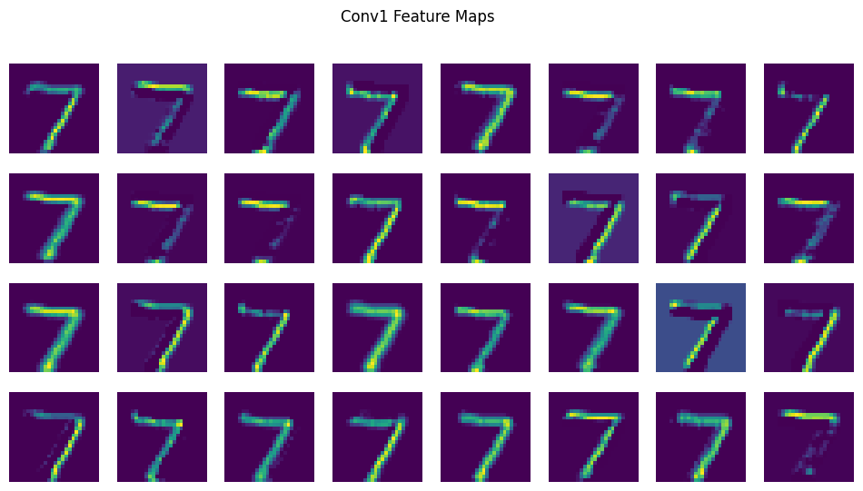
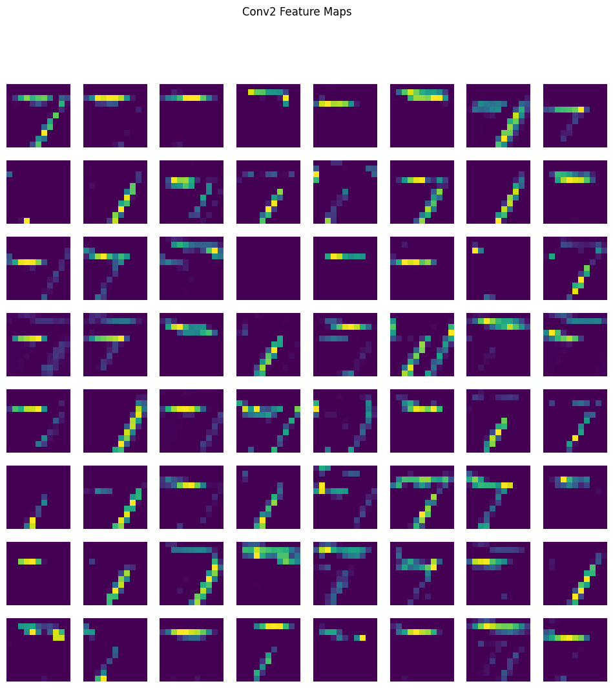

# CNN Feature Extraction and Feature Map Visualization on MNIST

## Project Overview

This project demonstrates the implementation of a Convolutional Neural Network (CNN) using Convolution, ReLU, and MaxPooling layers on the MNIST handwritten digit dataset. The primary objective is to understand how CNNs extract meaningful features from images and visualize the generated feature maps.

---

## Objective

* Build a CNN model for handwritten digit classification.
* Extract intermediate feature maps from convolutional layers.
* Visualize learned features to understand CNN behavior.
* Achieve accurate classification on the MNIST dataset.

---

## Dataset

### MNIST Dataset

* Total Images: 70,000
* Training Images: 60,000
* Testing Images: 10,000
* Image Size: 28 × 28 pixels
* Classes: 10 (Digits 0–9)
* Image Type: Grayscale

---

## CNN Architecture

Input Image (28×28)

↓

Convolution Layer

↓

ReLU Activation

↓

MaxPooling Layer

↓

Convolution Layer

↓

ReLU Activation

↓

MaxPooling Layer

↓

Fully Connected Layer

↓

Output Layer (0–9)

---

## Workflow

1. Load MNIST dataset.
2. Normalize image pixel values.
3. Build CNN architecture.
4. Train the model.
5. Extract feature maps from convolution layers.
6. Visualize feature maps.
7. Evaluate classification performance.

---

## Feature Map Visualization

### First Convolution Layer



### Second Convolution Layer



### Combined Feature Map Output


---

## Results

* CNN successfully classifies handwritten digits.
* Feature maps capture edges, curves, and digit structures.
* Deeper layers learn more abstract features.
* Visualization helps interpret CNN learning behavior.

---

## Technologies Used

* Python
* TensorFlow / Keras
* NumPy
* Matplotlib
* Google Colab

---

## Applications

* Handwritten Digit Recognition
* Optical Character Recognition (OCR)
* Document Processing
* Postal Code Recognition
* Bank Cheque Verification

---

## Repository Structure

```text
CNN-MNIST-Feature-Map-Visualization/
│
├── CNN_Feature_Extraction_and_Feature_Map_Visualization_using_MNIST.ipynb
├── conv1_featuremaps.png
├── conv2_featuremaps.png
├── output_featuremaps.png
└── README.md
```

---

## Author

Jay Prakash

M.Tech (Artificial Intelligence)

National Institute of Technology Jalandhar

---

## License

This project is developed for educational and academic purposes.

